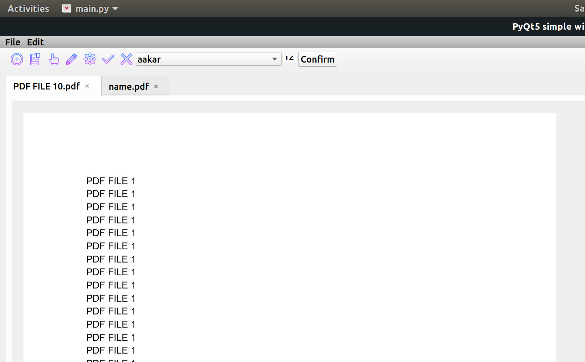
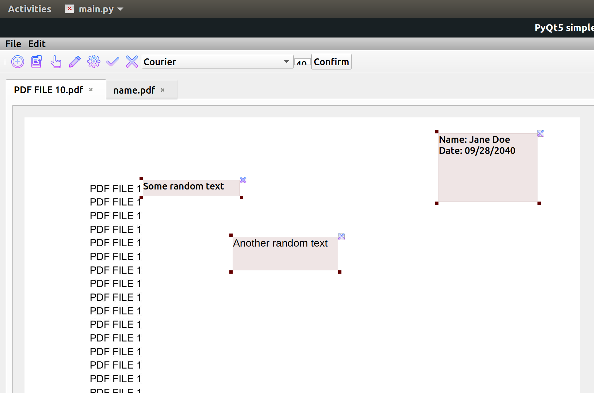
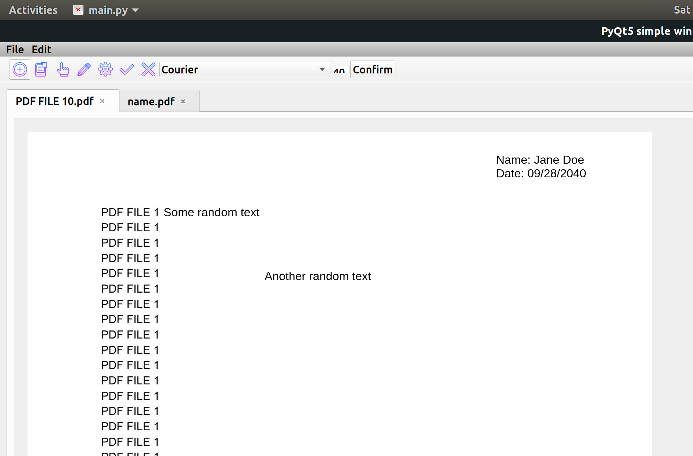

# pdf-light-editor
## Lightweight pdf editor for editing small pdf files.

This project is a pdf editor written with use of Python, PyQt5, img2pdf, pdf2img, pyPDF2. Currently has following features:

- Opens and display pdf pages in a scrollable view
- Allows insertion of draggable, resizable text box
- Allows saving pdf files

